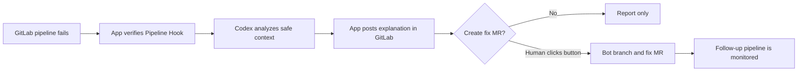

# Codex Pipeline Triage

Codex Pipeline Triage is a GitLab-connected demo app for failed CI/CD pipelines. A failed GitLab pipeline event triggers the app, the app builds bounded context from GitLab, Codex analyzes the failure through the Codex SDK, and the app reports findings back into GitLab.

This repository is the implementation home for Codex Pipeline Triage. "Pipeline Fixxer" is retained only as historical planning context.

## Current State

Status: demo hardening, ready for Spike 8.2 review.

Implemented:

- FastAPI app with health endpoint, GitLab OAuth login/logout, session cookies,
  and GitLab group authorization.
- Connected project form, project-token validation, group-boundary check, and
  server-side token storage boundary.
- Webhook setup page with one-time webhook secret display and stored secret hash.
- GitLab Pipeline Hook intake with webhook-token verification, project matching,
  classification, duplicate handling, and Job Hook ignore behavior.
- Bounded/redacted GitLab context builder for jobs, failed traces, and diffs.
- Server-side Codex adapter path with timeout, read-only/no-approval controls,
  Pydantic validation, and visible mock fallback.
- MR notes, branch issue reporting, retry action, fix MR creation, and follow-up
  monitor status notes behind deterministic GitLab executor/client boundaries.
- SQLite persistence for connected projects, triage runs, action logs, and
  monitor records.
- Minimal app UI for connected projects, webhook setup, run history, and run
  detail inspection.

## Product Shape

### Executive View



The short version: a failed pipeline becomes a clear GitLab note, and an
optional human-approved button can create a bot fix MR. The app does not commit
to the user's branch and does not auto-merge.

### Engineering Safety View

```mermaid
flowchart LR
    GL[GitLab MR pipeline fails] -->|Pipeline Hook only| WR[Webhook receiver]
    WR --> WV{Verify webhook secret<br/>and connected project}
    WV -->|valid failed pipeline| ID[Classify and dedupe run]
    WV -->|Job Hook or duplicate| IG[Ignore]
    WV -->|bad token, unknown project,<br/>malformed pipeline| FC[Fail closed]

    ID --> CB[Build bounded context<br/>jobs, traces, diffs, metadata]
    CB --> RT[Redact and truncate<br/>untrusted GitLab content]
    RT --> CX[Server-side Codex SDK<br/>read-only, no approvals]
    CX --> SV{Pydantic schema validation}
    SV -->|valid| PR[Persist triage result]
    SV -->|timeout or invalid| FB[Visible fallback result]

    PR --> PG{Project policy gate}
    FB --> PG

    PG -->|default report path| PN[Post MR note or issue note]
    PG -->|manual action allowed<br/>human click| BTN[Run-detail button:<br/>Create bot fix MR]

    BTN --> EX[Deterministic glab executor]
    EX --> BC[Create bot branch commit]
    BC --> FM[Create fix MR]
    FM --> PM[Create follow-up monitor]
    PM --> FH[Later Pipeline Hook<br/>closes monitor]
    FH --> MN[Post final monitor note]

    PN --> AUD[(SQLite audit trail)]
    MN --> AUD

    OA[GitLab OAuth login] --> GA[Group authorization gate]
    GA --> CP[Connected project setup]
    CP --> PT[Project token stays server-side]
    CP --> WH[Webhook secret stored as hash]

    PT -. reads context .-> CB
    PT -. posts notes .-> PN
    PT -. controlled writes .-> EX
    WH -. verifies .-> WV
```



Pipeline events are the only root workflow trigger. Job Hooks and duplicates do
not start workflows; invalid webhook, token, or project state fails closed.
GitLab logs, diffs, and metadata are treated as untrusted, bounded and redacted
before server-side Codex runs. Codex output must pass Pydantic validation, and
every GitLab mutation goes through deterministic executor code after project
policy checks.

## Core Decisions

- Use **GitLab Pipeline events** as the primary trigger.
- Keep **GitLab Job events** disabled by default; they are optional telemetry later.
- Use GitLab OAuth/OIDC for app login, then enforce a GitLab group-membership gate.
- Restrict connected demo projects to the configured GitLab group.
- Use a GitLab service account or project/bot token for GitLab API actions.
- Prefer the GitLab CLI (`glab`) as the deterministic GitLab API executor surface.
- Use the OpenAI **Codex SDK** server-side for triage.
- Do not let Codex directly mutate GitLab. GitLab side effects happen only in deterministic executor code.
- Default project policy is conservative: report findings and create/reuse issues. Retry and fix MR creation are opt-in later actions.

## Behavior

### Merge Request Pipelines

When a failed pipeline belongs to a merge request:

1. Analyze the failed pipeline.
2. Post findings to the existing MR.
3. Persist the triage run and audit record.
4. If policy allows it, retry a safe transient failure or create a bot-branch
   fix MR.
5. If a fix MR is created, persist a follow-up monitor and post the later
   pipeline result back to the original MR.

### Branch Pipelines Without MR

When a failed pipeline is not attached to an MR:

1. Create or reuse a GitLab issue for the failed pipeline.
2. Post findings to the issue.
3. Persist the triage run and audit record.
4. Controlled retry and fix MR actions remain policy-gated and deterministic.

## Demo Fit

This is intended to satisfy the OpenAI Codex demo-app requirement:

| Requirement | Implementation |
|---|---|
| Demo app for major eCommerce hackathon | Use a synthetic checkout/cart demo repo with an intentionally broken pipeline. |
| Codex can build impressive apps | The app is a working GitLab workflow, not a standalone toy UI. |
| Programmatic Codex use | Server-side Codex Python SDK path with timeout, read-only controls, and schema-validated output. |
| Login / authorization | GitLab OAuth/OIDC plus GitLab group authorization. |
| Data persistence | Connected projects, triage runs, action logs, monitors. |
| Meaningful tests | Auth, webhook verification, pipeline filtering, Codex schema gate, GitLab action rendering. |
| Working UX | GitLab MR notes and issues are the primary UX; app UI shows configuration and run history. |

## Repository Docs

- [SPEC.md](SPEC.md) - application specification and implementation contract.
- [SPIKES.md](SPIKES.md) - iterative stage/spike plan with handoff gates.
- [DEMO-STATE.md](DEMO-STATE.md) - demo scenario, recording plan, and current state.
- [DEMO-SCRIPT.md](DEMO-SCRIPT.md) - five-minute Loom runbook and demo checklist.
- [AGENTS.md](AGENTS.md) - instructions for agents and developers working in this repo.
- [ADR-0001-runtime-stack.md](ADR-0001-runtime-stack.md) - current runtime stack decision.

Local-only context lives in `.local/`. It is intentionally ignored by Git and can contain absolute workstation paths and zettelkasten cross-links.

## Post-MVC Documentation TODO

After the MVC/demo path is complete, rebuild the public development artifacts as
a coherent tracked set:

- `AGENTS.md`
- public `ROADMAP.md`
- `SPEC.md`
- `SPIKES.md`
- `README.md`
- public ADRs and demo-development notes

Keep private prompts, reviewer handoffs, local manual-test evidence, workstation
paths, and sensitive/demo-only coordination notes in `.local/`.

## Planned Stack

- Python 3.10+
- `uv`
- FastAPI for HTTP routes, webhooks, sessions, and tests.
- FastHTML only if it keeps the configuration UI simpler than templates.
- OpenAI Codex Python SDK for server-side triage.
- `glab` CLI for GitLab API execution through a deterministic wrapper.
- Pydantic
- SQLite for local/demo persistence
- pytest
- Black, isort, flake8, pylint, mypy, and pytest-cov

The stack stays Python-first. Any future fallback must be captured in an ADR
before implementation changes and must still satisfy the OpenAI assignment by
using a real Codex surface, not a generic OpenAI Responses API call.

Python project setup follows GitLab's Python style and project guides, with one local deviation: `uv` replaces the Poetry examples as the dependency/environment manager.

## Environment Overview

Do not commit real values.

```text
APP_BASE_URL=
SESSION_SECRET=

GITLAB_BASE_URL=https://gitlab.com
GITLAB_OAUTH_CLIENT_ID=
GITLAB_OAUTH_CLIENT_SECRET=
AUTH_ALLOWLIST_MODE=gitlab_group
ALLOWED_GITLAB_GROUP_ID=
ALLOWED_GITLAB_PROJECT_GROUP_ID=
GITLAB_EXECUTOR_MODE=glab
GITLAB_SERVICE_ACCOUNT_USERNAME=

OPENAI_API_KEY=
PIPELINE_TRIAGE_MODE=mock
PIPELINE_TRIAGE_CODEX_MODEL=
PIPELINE_TRIAGE_CODEX_TIMEOUT_SECONDS=
PIPELINE_TRIAGE_CODEX_BIN=

TRIAGE_DATA_FILE=.local/triage.sqlite
```

Connected project tokens and webhook secrets are created through the app and stored server-side. They must never be exposed to the browser or logs. The `glab` wrapper must run non-interactively with a controlled token/config boundary, not with a developer's ambient personal session.

## Demo Readiness

The repo has passed the manual gates through Spike 8.1, including the failed
follow-up monitor path for a bot fix MR. Spike 8.2 adds the recording script,
run-detail polish, and final doc cleanup before the final review.

Use [DEMO-SCRIPT.md](DEMO-SCRIPT.md) for the five-minute dry run. Keep all
tokens, webhook secrets, OAuth callback values, cookies, Cloudflare tunnel URLs,
and raw webhook payloads in local-only files or environment variables.

## Iterative Build Model

Build this in spikes, not as one long implementation push.

Each spike follows this loop:

```text
dev team implements one spike
  -> dev handoff
  -> pair code reviewer team review
  -> Falko manual test or explicit skip
  -> fixes if needed
  -> next spike only after approval
```

Use [SPIKES.md](SPIKES.md) for the stage plan and keep local dev/reviewer
handoffs in `.local/`.

## Next Build Step

Finish **Spike 8.2 - Demo Hardening** review and manual dry run. Do not add new
GitLab side effects, auto-merge, new Codex action behavior, or monitoring
expansion during the demo polish pass.
